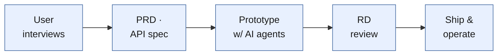

# Hi, this is Sandy 👋

### Builder-type Product Manager — I write the spec, then ship it.
Websites · E-commerce · Internal Tools · Team AI Enablement

📍 Taipei · 3 years across automotive → gaming hardware → font technology  
🎯 Open to Product Manager roles — B2B SaaS · DevTools · Design Tooling

---

## 🔁 How I Work

A PM's value isn't passing requirements down the line — it's turning a vague problem into a spec a team can actually execute. I write the PRD, API spec and architecture myself, build the first working version with AI coding agents, then hand it to RD for review and ship it.

**Last 12 months:** a brand site · a B2B e-commerce platform · 2 internal production tools · a department-wide AI enablement program.
This profile is where I keep the actual work — architecture diagrams, API specs, and the reasoning behind each decision.

---

## 🛠️ Core Skills

| Area | Skills |
|------|------|
| **Product Definition** | Problem framing · Requirement prioritization |
| **User Research** | Cross-functional, cross-city interviews · HMW framing |
| **Specs & Docs** | PRD · API specification · System architecture · DB schema |
| **Tech Stack** | Next.js · React · TypeScript · Python · Bash · Vercel |

---

## 📂 Selected Experience

| Project | When | Highlight |
|------|------|------------|
| **[Font Naming Tool](https://github.com/tsaitsenshan/font-naming-tool)** | 2026 | Naming + trademark-collision check, 1–2 hrs → under 15 min per family |
| **[Font Shop Platform](https://github.com/tsaitsenshan/font-shop-platform)** | 2026 | B2B storefront, spec to launch in 1 week · 10+ client shops, 370+ fonts |
| **[Team AI Enablement](https://github.com/tsaitsenshan/team-ai-enablement)** | 2025–2026 | 8 reusable skills · 15 active users across 2 offices |

> 📝 Case studies are written in Traditional Chinese — my working language, and the language these products were actually built in.

---

## 📫 Contact

📧 tsaitsenshan33@gmail.com ｜ 🌐 [hyfont.com](https://www.hyfont.com) — brand site I delivered the frontend for

